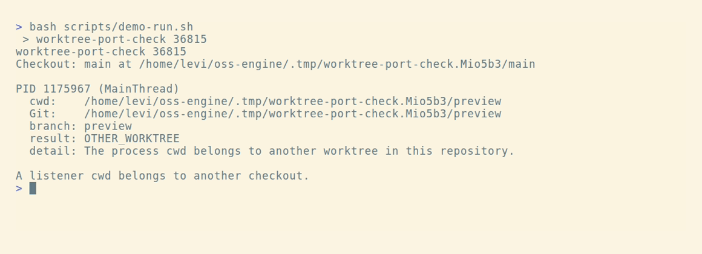

<h1 align="center">
  <br>
  worktree-port-check
</h1>

<p align="center">
  <strong>Check whether the process listening on a port has its current directory inside your Git worktree.</strong>
</p>

<p align="center">
  <a href="https://github.com/Arthur031221/worktree-port-check/stargazers"></a>
  <a href="https://github.com/Arthur031221/worktree-port-check/actions/workflows/ci.yml"></a>
  <a href="LICENSE"></a>
</p>

<p align="center">
  <a href="#quickstart">&#x26A1; Quickstart</a> &#x2022;
  <a href="#how-it-works">&#x1F50D; How it works</a> &#x2022;
  <a href="#examples">&#x1F4D6; Examples</a> &#x2022;
  <a href="#faq">&#x1F4AC; FAQ</a>
</p>

> [!TIP]
> Run it from the Git worktree you are testing:
> ```sh
> npx --yes --package=github:Arthur031221/worktree-port-check worktree-port-check 3000
> ```

<p align="center">
  
</p>

## Why worktree-port-check

A preview server can keep running after you switch terminals or open a linked worktree. The port still belongs to a process whose current directory may point at another checkout.

worktree-port-check compares your current Git checkout with every visible process listening on one TCP port. It prints each process cwd, Git root, branch, and comparison result.

A matching cwd does not prove which files a server loaded or serves. This check reports process and Git metadata, not application behavior.

## Features

- &#x1F50E; **Checks every visible owner:** Reports all listener processes found for the selected TCP port.
- &#x1F33F; **Recognizes linked worktrees:** Compares checkout roots and Git common directories.
- &#x1F9ED; **Shows useful context:** Prints process id, command, cwd, Git root, and branch.
- &#x1F4C4; **Offers JSON output:** Use the result in a shell script or another local tool.
- &#x1F512; **Reads local process metadata:** Does not signal processes, bind to the port, or send an HTTP request.
- &#x1FA9F; **Reports inspection gaps:** Shows when permissions, changing listeners, or system diagnostics limit the result.

## Quickstart

You need Node.js 20 or newer, Git, and `lsof` on macOS or Linux.

Run from the Git worktree you are checking:

```sh
npx --yes --package=github:Arthur031221/worktree-port-check worktree-port-check 3000
```

The command returns 0 when every visible listener has the same checkout root, 1 when a listener has a different checkout, 2 when no listener is visible, 3 when a listener cwd is outside a Git worktree, 4 when inspection is incomplete, and 64 for invalid arguments.

When the listener runs from a linked worktree, the result includes:

~~~text
result: OTHER_WORKTREE
detail: The process cwd belongs to another worktree in this repository.
~~~

## Examples

Check a local development server:

```sh
npx --yes --package=github:Arthur031221/worktree-port-check worktree-port-check 3000
```

Ask for machine-readable output:

```sh
npx --yes --package=github:Arthur031221/worktree-port-check worktree-port-check 3000 --json
```

Run against another port:

```sh
npx --yes --package=github:Arthur031221/worktree-port-check worktree-port-check 4173
```

A linked worktree mismatch is reported as `OTHER_WORKTREE`. A process outside a Git worktree is reported as `NON_GIT`.

## How it works

The command asks `lsof` for TCP listeners on the selected port, then reads each visible process cwd. It uses Git to resolve the checkout root and common directory for that cwd and for the current directory. A shared common directory identifies linked worktrees in one repository. Branch names are shown as context and do not decide the result.

| Tool | What it reports | Use it when |
| --- | --- | --- |
| [lsof](https://github.com/lsof-org/lsof/blob/master/docs/manpage.md) | Process and open file details, including network sockets | You want the operating system view of a port |
| [port-whisperer](https://github.com/LarsenCundric/port-whisperer) | Port owner information with process and repository context | You want a broader port inspection workflow |
| worktree-port-check | Whether visible listener cwd values match the current Git checkout | You want a focused check before using a preview URL |

The command relies on OS visibility. It cannot inspect processes hidden by permissions, detect code a server loaded before changing directory, or prove what response an application serves.

## FAQ

### Does a matching result prove the server uses my current source?

No. It means the listener process cwd resolves to the same Git checkout root. The server may have loaded files earlier or may serve a different directory.

### Why is a result incomplete?

The OS may hide a process cwd, `lsof` may report a diagnostic, or the listener set may change between two reads. The output includes the reason when it can.

### Does it stop or restart anything?

No. It reads process and Git metadata. It does not send signals or make network connections.

<details>
<summary>Exit codes and implementation details</summary>

| Code | Meaning |
| --- | --- |
| 0 | Every visible listener matches the current checkout |
| 1 | At least one listener belongs to another checkout |
| 2 | No listener is visible on the port |
| 3 | A listener cwd is outside a Git worktree |
| 4 | The inspection is incomplete or the current directory is not a Git worktree |
| 64 | Invalid arguments |

The command reads NUL-delimited `lsof` fields so spaces and colons in socket names do not affect process grouping. It checks the listener list twice and reports when the process and file descriptor set changes.

On Linux it reads cwd links under `/proc`. On macOS it asks `lsof` for the process cwd. Git commands run without inherited `GIT_*` variables and with optional index locks disabled.

</details>

## Contributing

See [CONTRIBUTING.md](CONTRIBUTING.md) for local setup and tests.

## License

MIT. See [LICENSE](LICENSE).
